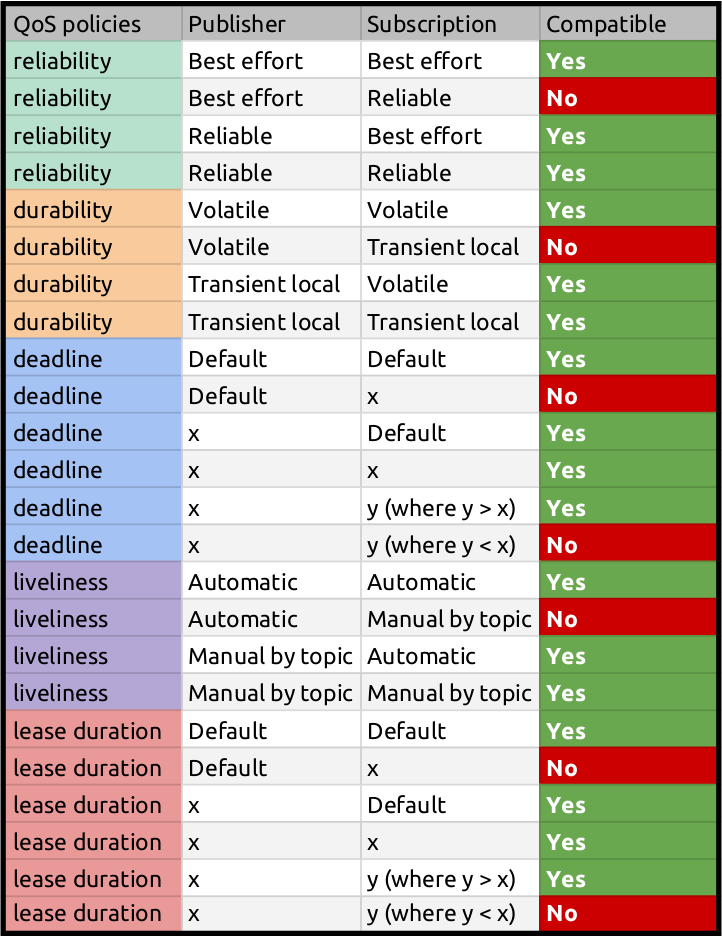

### `qos_tests_pkg`

#### ROS2 architecture overview

| Overview | Client library |
| --- | --- |
|  |  |

#### Compatible QoS in pub and sub

1. Declare DDS (**D**ata **D**istribution **S**ervice) explicitly (**RMW** means **R**OS **M**iddle**w**are interface)
   `export RMW_IMPLEMENTATION=rmw_cyclonedds_cpp`
2. A Python [launch file](launch/pub_sub_min_qos.launch.py) has been setup with the `reliablity` argument for pub
   `ros2 launch qos_tests_pkg pub_sub_min_qos.launch.py`
   with output
   ```
   user:~/ros2_ws$ ros2 launch qos_tests_pkg pub_sub_min_qos.launch.py
   [INFO] [launch]: All log files can be found below /home/user/.ros/log/2024-08-12-23-44-45-169160-1_xterm-8686
   [INFO] [launch]: Default logging verbosity is set to INFO
   [INFO] [launch.user]: reliable
   [INFO] [sub_custom_min_qos_node-1]: process started with pid [8688]
   [INFO] [pub_custom_min_qos_node-2]: process started with pid [8690]
   [pub_custom_min_qos_node-2] [INFO] [1723506286.341760929] [publisher_qos_obj]: Publishing: 0:1723506286.341601,1723506286341601112
   [sub_custom_min_qos_node-1] [INFO] [1723506286.341776039] [subscriber_qos_obj]: Data Received = '0:1723506286.341601,1723506286341601112'
   [pub_custom_min_qos_node-2] [INFO] [1723506287.341722974] [publisher_qos_obj]: Publishing: 1:1723506287.341584,1723506287341583702
   [sub_custom_min_qos_node-1] [INFO] [1723506287.341726576] [subscriber_qos_obj]: Data Received = '1:1723506287.341584,1723506287341583702'
   [pub_custom_min_qos_node-2] [INFO] [1723506288.341712407] [publisher_qos_obj]: Publishing: 2:1723506288.341574,1723506288341574149
   [sub_custom_min_qos_node-1] [INFO] [1723506288.341718761] [subscriber_qos_obj]: Data Received = '2:1723506288.341574,1723506288341574149'
   [sub_custom_min_qos_node-1] [INFO] [1723506289.341716643] [subscriber_qos_obj]: Data Received = '3:1723506289.341569,1723506289341569147'
   [pub_custom_min_qos_node-2] [INFO] [1723506289.341715708] [publisher_qos_obj]: Publishing: 3:1723506289.341569,1723506289341569147
   [pub_custom_min_qos_node-2] [INFO] [1723506290.341724369] [publisher_qos_obj]: Publishing: 4:1723506290.341562,1723506290341561857
   [sub_custom_min_qos_node-1] [INFO] [1723506290.341726983] [subscriber_qos_obj]: Data Received = '4:1723506290.341562,1723506290341561857'
   [pub_custom_min_qos_node-2] [INFO] [1723506291.341686349] [publisher_qos_obj]: Publishing: 5:1723506291.341551,1723506291341550795
   ```
3. When an incompatible QoS is caused by the argument `reliability:="best_effort"`, the output is different
   ```
   user:~/ros2_ws$ ros2 launch qos_tests_pkg pub_sub_min_qos.launch.py reliability:="best_effort"
   [INFO] [launch]: All log files can be found below /home/user/.ros/log/2024-08-12-23-47-56-998649-1_xterm-9015
   [INFO] [launch]: Default logging verbosity is set to INFO
   [INFO] [launch.user]: best_effort
   [INFO] [sub_custom_min_qos_node-1]: process started with pid [9017]
   [INFO] [pub_custom_min_qos_node-2]: process started with pid [9019]
   [sub_custom_min_qos_node-1] [WARN] [1723506477.175614628] [subscriber_qos_obj]: New publisher discovered on topic '/qos_test', offering incompatible QoS. No messages will be sent to it. Last incompatible policy: RELIABILITY_QOS_POLICY
   [pub_custom_min_qos_node-2] [ERROR] [1723506477.182932190] [publisher_qos_obj]: A subscriber asking for an INCOMPATIBLE QoS triggered!
   [pub_custom_min_qos_node-2] [ERROR] [1723506477.183032504] [publisher_qos_obj]: Offered incompatible qos - total 1 delta 1 last_policy_kind: 16
   [pub_custom_min_qos_node-2] [ERROR] [1723506477.186205165] [publisher_qos_obj]: A subscriber asking for an INCOMPATIBLE QoS triggered!
   [pub_custom_min_qos_node-2] [ERROR] [1723506477.186241680] [publisher_qos_obj]: Offered incompatible qos - total 2 delta 1 last_policy_kind: 16
   [pub_custom_min_qos_node-2] [INFO] [1723506478.174819389] [publisher_qos_obj]: Publishing: 0:1723506478.174784,1723506478174783980
   [pub_custom_min_qos_node-2] [INFO] [1723506479.174802272] [publisher_qos_obj]: Publishing: 1:1723506479.174770,1723506479174770454
   [pub_custom_min_qos_node-2] [INFO] [1723506480.174785285] [publisher_qos_obj]: Publishing: 2:1723506480.174753,1723506480174752923
   [pub_custom_min_qos_node-2] [INFO] [1723506481.174786918] [publisher_qos_obj]: Publishing: 3:1723506481.174754,1723506481174754290
   [pub_custom_min_qos_node-2] [INFO] [1723506482.174798262] [publisher_qos_obj]: Publishing: 4:1723506482.174758,1723506482174757744
   ```

#### Compatibility table

  
